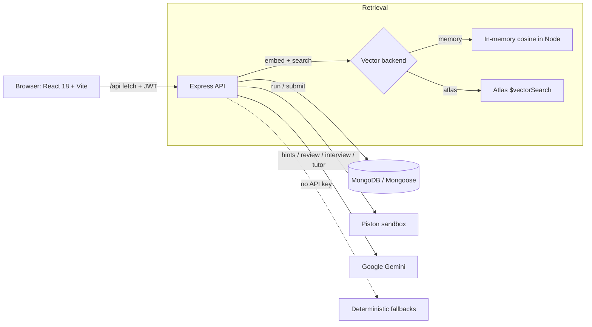
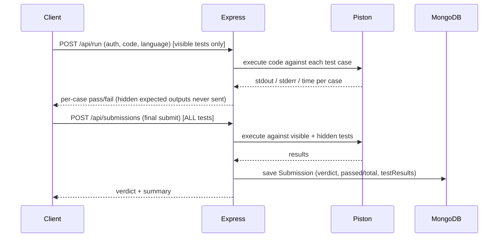
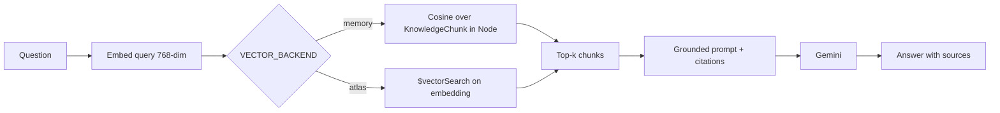
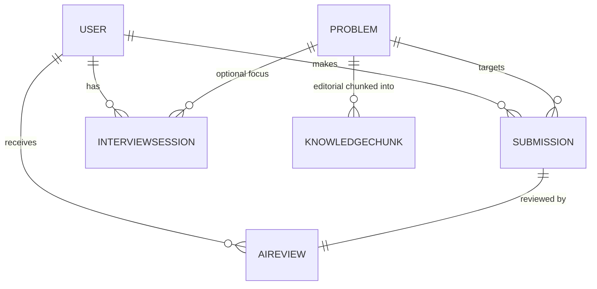

# CodeSage — Architecture

A technical reference for how CodeSage is put together: the guiding design idea, the
runtime shape, the request flows, the data model, and the security posture. If you just
want to run it, read [`SETUP.md`](SETUP.md) instead.

---

## 1. Design philosophy: LLM + deterministic verification

The single idea the whole system is organized around: **the LLM never decides whether code
is correct.** A sandboxed code-execution judge does. The model is layered on top purely as a
coach — it explains, hints, critiques, and interviews, but every correctness claim it makes
is *grounded* in a verdict produced by the judge.

Consequences of that choice, which show up everywhere in the code:

- **Correctness is a judge verdict** (`AC / WA / TLE / CE / RE`), stored on the `Submission`.
- **AI code review copies the judge verdict** into `AIReview.groundedVerdict`; complexity
  figures are explicitly labelled *estimates*, not proofs.
- **AI is optional.** If `GEMINI_API_KEY` is absent, `config.aiEnabled` is `false` and every
  AI feature degrades to a clear, deterministic fallback. Auth, the problem catalog, the
  judge, and the dashboard all keep working.

This is the thing worth talking about: it is an honest, defensible use of an LLM.

---

## 2. Runtime topology



- **Frontend** — React 18 + Vite, `react-router`, the Monaco editor, `react-markdown`, and a
  hand-written CSS design system (no Tailwind). The JWT lives in memory (via `AuthContext`),
  never in `localStorage`.
- **Backend** — Node + Express (ES Modules). `createApp()` in `server/src/index.js` is a
  factory (importable by tests); the server only calls `listen()` when the file is run
  directly. Global middleware: `helmet`, `cors` (locked to `CLIENT_URL`), `express.json`
  (1 MB cap), `morgan` (skipped under test), and a general rate limiter on `/api`.
- **Execution** — untrusted user code is sent to the **Piston** public API, never executed on
  our server. Judge0 is the documented self-hosted "production" path.
- **AI** — Google Gemini behind a provider adapter (`llmProvider` → `aiService`) so the vendor
  is swappable and offline fallbacks live in one place.

---

## 3. Backend layering

Requests flow through clean layers — routes wire URLs to controllers, controllers orchestrate,
services hold the real logic, models own persistence:

```
routes/  →  controllers/  →  services/  →  models/
                │                │
           middleware/       utils/  (token, cache, backoff, vector, sse, validation)
```

Key services:

| Service | Responsibility |
|---|---|
| `execService.js` | Talks to Piston; normalizes stdout, maps runner results to `AC/WA/TLE/CE/RE`, times each case. |
| `llmProvider.js` | Thin adapter over the Gemini SDK (`@google/genai`) — text generation + embeddings. The only vendor-specific file. |
| `aiService.js` | Higher-level AI features (hints, review, interview turns, RAG answers) built on `llmProvider`; owns the offline fallbacks and exposes `aiAvailable()`. |
| `ragService.js` | Embed → retrieve → assemble grounded context. Retrieval is behind one interface with two backends: `memory` (cosine in Node) or `atlas` (`$vectorSearch`). |

Cross-cutting `utils`: `token` (JWT sign/verify), `cache` (memoize generic hints to save quota),
`backoff` (exponential retry for the LLM/judge), `vector` (L2-normalize + cosine/dot), `sse`
(Server-Sent Events helpers), `validation` (Zod schemas).

---

## 4. Request flows

### 4.1 Run / Submit (the deterministic core)



`/run` uses **visible** tests only (fast feedback); `/submissions` runs the full hidden set and
persists a `Submission`. Both are auth-gated and behind the tighter `execLimiter`.

### 4.2 Streaming AI hint

Hints (and interview turns) stream token-by-token over **Server-Sent Events**. SSE is one-way
(server→client), simpler than WebSockets, and the client reads it with `fetch` (via the `useSSE`
hook) so it can attach the `Authorization` header — which the native `EventSource` cannot do.
Hint prompts carry a hard guardrail ("never reveal a full solution"); generic hints are cached.

### 4.3 RAG concept tutor



Embeddings are **L2-normalized** at ingest, so cosine similarity reduces to a dot product. The
`memory` backend ranks entirely in Node (zero infra — great for local dev); the `atlas` backend
uses MongoDB Atlas Vector Search. Same interface, chosen by the `VECTOR_BACKEND` flag.

### 4.4 Mock interview

`POST /interviews` starts a session; `POST /interviews/:id/message` streams the interviewer's
reply and appends to `messages`; `POST /interviews/:id/finish` produces a structured scorecard.
**The transcript *is* the conversation state** — the full `messages` array is persisted and
replayed to the model on each turn, so sessions are resumable and auditable.

---

## 5. Data model

Six Mongoose collections. Passwords are `select:false`; vectors live in their own collection so
they never bloat hot reads.



| Model | Key fields | Notes |
|---|---|---|
| **User** | `name`, `email` (unique), `passwordHash` (`select:false`), `role` (`user`/`admin`), `stats{solved, attempts, byTopic Map, byDifficulty}` | bcrypt via `setPassword`/`comparePassword`; `toSafeJSON()` never leaks the hash. |
| **Problem** | `slug` (unique), `title`, `statement` (md), `difficulty`, `topics[]`, `companies[]`, `constraints`, `examples[]`, `testCases[]{input, expectedOutput, isHidden}`, `starterCode` Map<lang,code>, `editorial`, `timeLimitMs` | Text index on `title`+`statement` powers keyword search; `difficulty`/`topics` indexed. |
| **Submission** | `user`, `problem`, `language`, `code`, `verdict` (`AC/WA/TLE/CE/RE`), `passedCount`, `totalCount`, `runtimeMs`, `testResults[]` | Compound index `{user, problem, createdAt:-1}` for the hot "my attempts" query. |
| **InterviewSession** | `user`, `problem?`, `status` (`active`/`finished`), `messages[]{role, content, ts}`, `finalEvaluation{problemSolving, communication, codeQuality, overall, notes}`, `finishedAt` | Transcript = conversation state. |
| **AIReview** | `submission`, `user`, `model`, `timeComplexity`, `spaceComplexity`, `codeQualityScore` (1–10), `strengths[]`, `improvements[]`, `edgeCasesMissed[]`, `groundedVerdict`, `raw` | `groundedVerdict` copied from the judge; complexity are estimates. |
| **KnowledgeChunk** | `text`, `embedding[]` (=`GEMINI_EMBED_DIM`, default 768), `source`, `title`, `topics[]`, `companies[]`, `problem?` | Own collection so the vector array never bloats Problem/Submission reads. Atlas index: cosine, `numDimensions=768`, filters on `topics`/`companies`. |

---

## 6. API reference

Base path: `/api`. `[auth]` = valid JWT required; `[admin]` = admin role; `[stream]` = SSE.

| Method & path | Auth | Purpose |
|---|---|---|
| `GET /health` | — | Liveness + whether AI is on. |
| `POST /auth/register` | — | Create account, returns JWT. |
| `POST /auth/login` | — | Login, returns JWT. |
| `GET /auth/me` | [auth] | Current user (safe shape). |
| `GET /problems` | — | List/browse catalog (supports `?search=`). |
| `GET /problems/:slug` | — | Problem detail — **hidden tests stripped**. |
| `POST /run` | [auth] | Execute against **visible** tests (fast feedback). |
| `POST /submissions` | [auth] | Final submit against **all** tests; persists a Submission. |
| `GET /submissions` | [auth] | List my submissions. |
| `GET /submissions/:id` | [auth] | One submission. |
| `POST /ai/hint` | [auth][stream] | Tiered (L1–3), guardrailed hint stream. |
| `POST /ai/review/:submissionId` | [auth] | Structured review anchored to the judge verdict. |
| `POST /ai/ask` | [auth] | RAG concept tutor (grounded + citations). |
| `POST /interviews` | [auth] | Start a mock interview. |
| `POST /interviews/:id/message` | [auth][stream] | Send a turn; stream the interviewer reply. |
| `POST /interviews/:id/finish` | [auth] | End session + produce scorecard. |
| `GET /interviews/:id` | [auth] | Fetch a session/transcript. |
| `GET /me/stats` | [auth] | Dashboard aggregates + readiness score. |
| `POST /admin/kb/ingest` | [admin] | Ingest/re-embed the RAG knowledge base. |

Execution routes use a tighter `execLimiter`; all `/ai/*` and `/interviews/*` routes use an
`aiLimiter` to protect the Gemini quota.

---

## 7. Security posture

- **Passwords**: bcrypt hashes, `select:false` (never returned by default queries).
- **Auth**: stateless JWT (HS256) verified in `requireAuth`; `requireRole('admin')` gates the
  ingest route. The token lives in client memory, not `localStorage`.
- **Untrusted code**: executed only in the Piston sandbox, never on the API host.
- **Data leakage**: hidden test cases and their expected outputs never reach the client.
- **Input**: Zod validation on request bodies; `express.json` capped at 1 MB; `helmet` headers;
  CORS locked to `CLIENT_URL`; rate limits on general, exec, and AI routes.
- **Prompt-injection awareness**: problem statements and user code are treated as untrusted when
  composed into prompts. On the Gemini free tier prompts may be used for training, so real PII
  should not be sent.

---

## 8. Configuration

All config is read once in `server/src/config/env.js` (see [`SETUP.md`](SETUP.md) for the full
`.env`). Notable behavior: `aiEnabled` is `true` only if `AI_ENABLED` is set **and** a
`GEMINI_API_KEY` exists — so the app boots and demos without a key. Missing key / dev JWT secret
produce loud warnings but do not crash.

---

## 9. Testing

`vitest` unit tests live in `server/tests/`: `exec.test.js` (output normalization + verdict
mapping) and `vector.test.js` (L2-normalization + cosine/dot correctness). Because `createApp()`
is exported, HTTP integration tests with `supertest` can mount the app without opening a socket
or requiring live Piston/Gemini (both are mockable).

---

## 10. Scaling

Scaling and load discussion (stateless API + horizontal scale, judge worker pool/queue, caching,
Atlas vector search, a 50k-participant contest walkthrough) is kept in the private prep notes and
is out of scope for this public reference.
